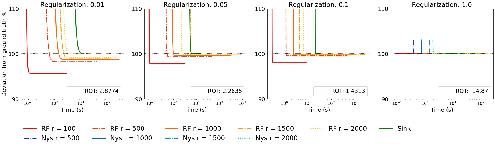

# Linear Time Sinkhorn Divergences using Positive Features
Code of the paper by Meyer Scetbon and Marco Cuturi

## Approximation of the Regularized Optimal Transport in Linear Time

We present the time-accuracy tradeoff between different methods to compute the regularized OT when the samples live on the unit sphere.

The implementation of the recursive Nystrom is adapted from the MATLAB implementation (https://github.com/cnmusco/recursive-nystrom)

## Generative Adversarial Network
The implementation of the WGAN is a code adapted from the MMD-GAN implementation (https://github.com/OctoberChang/MMD-GAN).
We show some visual results of the generative model learned using our method on CIFAR10 (left) and CelebA (right). 

  
   

This repository contains a Python implementation of the algorithms presented in the [paper](https://arxiv.org/pdf/2006.07057.pdf).
